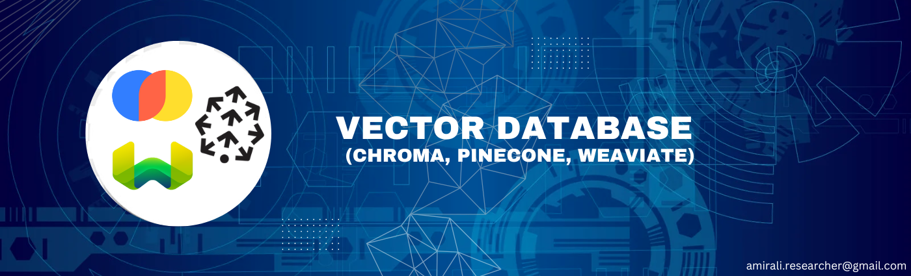

This repository documents my learning journey with Vector Databases for GenAI RAG applications. I explored, practiced, and implemented Chroma, Pinecone, and Weaviate to enhance retrieval efficiency in AI-driven systems. Through this process, I gained hands-on experience in vector search, indexing, querying, and integrating these databases into real-world RAG pipelines.

Outline:
1. Chroma Vector Database
2. Pinecone Vector Database
3. Weaviate Vector Database

### Referece
[1] https://docs.trychroma.com/docs
[2] https://docs.pinecone.io/guides
[3] https://weaviate.io/developers/weaviate
